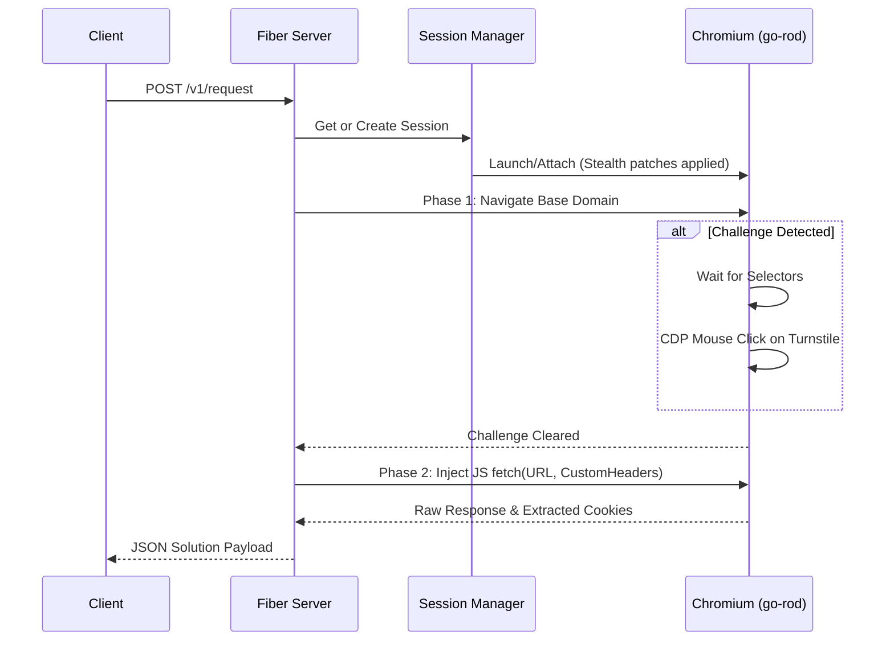

# Stealth

Stealth is a Go-based service for Cloudflare challenge resolution. It uses a headless Chromium browser managed by `go-rod` to bypass anti-bot pages and execute HTTP requests.

## Architecture & Flow

Stealth operates using a two-phase process for each request, enhanced by a fast-path caching mechanism:

1. **Phase 1: Hybrid Fast Path**: Before launching a browser, Stealth checks an in-memory `ClearanceCache`. If valid Cloudflare cookies exist for the requested domain and proxy, the request is executed immediately using a native Go HTTP client (`imroc/req/v3`) that mimics Chrome's TLS fingerprint (JA3/JA4).
2. **Phase 2: Clearance (Slow Path)**: If the cache misses or a challenge is detected, Stealth launches/reuses a persistent browser session. It navigates to the target, waits for challenge selectors, and solves Turnstile CAPTCHAs via direct CDP mouse coordinate clicks.
3. **Phase 3: Execution**: Once the challenge clears, Stealth injects a native `fetch()` call into the cleared page context, capturing the response and caching the new clearance cookies for future requests.



## Quick Start

### Docker

You can run the pre-built Docker image directly from the GitHub Container Registry:

```bash
docker run -d -p 8191:8191 ghcr.io/annurdien/stealth:latest
```

Alternatively, you can build and run using `docker compose`:

```bash
docker compose up -d
```
The service binds to port `8191` by default.

### Local Execution

Requires Go 1.24+ and a local Chromium/Chrome installation.

```bash
go run ./cmd/stealth
```

## Configuration

Configuration is managed via environment variables.

| Variable | Default | Description |
|---|---|---|
| `HOST` | `0.0.0.0` | Bind address for the HTTP server. |
| `PORT` | `8191` | HTTP server port. |
| `LOG_LEVEL` | `info` | Logging verbosity: `debug`, `info`, `warn`, `error`. |
| `HEADLESS` | `true` | Runs Chrome in headless mode. Set to `false` for debugging. |
| `MAX_TABS` | `10` | Maximum number of concurrent tabs (Incognito contexts) per physical browser pool. |
| `CHROME_BIN` | | Optional override for the Chromium binary path. |

## API Reference

### `GET /`
Returns service status and version information.

### `GET /health`
Returns a `200 OK` status. Used for container health checks.

### `POST /v1/request`
Primary endpoint for executing requests through the solver.

#### Request Schema

```json
{
  "url": "https://example.com/api/data",
  "method": "GET",
  "maxTimeout": 60000,
  "session": "session-id-string",
  "headers": { 
    "Authorization": "Bearer token",
    "X-Custom-Header": "value" 
  },
  "postData": "{\"key\":\"val\"}",
  "proxy": { 
    "url": "http://10.0.0.1:8080", 
    "username": "user", 
    "password": "pass" 
  },
  "userAgent": "Mozilla/5.0 (Windows NT 10.0; Win64; x64)...",
  "cookies": [
    { "name": "session_id", "value": "123", "domain": "example.com" }
  ],
  "returnOnlyCookies": false,
  "returnScreenshot": false,
  "disableMedia": true,
  "waitAfterMs": 1000
}
```

- **`url`** (string, required): The full target URL.
- **`method`** (string, optional): HTTP method. Defaults to `GET`.
- **`maxTimeout`** (integer, optional): Maximum execution time in milliseconds. Defaults to `60000`.
- **`session`** (string, optional): ID of an existing session to reuse, or ID to assign to a newly created session. If omitted, an ephemeral session is created and destroyed per request.
- **`headers`** (object, optional): Custom HTTP headers applied during the Phase 2 `fetch()`.
- **`postData`** (string, optional): Request body for POST requests.
- **`proxy`** (object, optional): Proxy configuration. Proxy authentication is handled via CDP `Fetch` domain interception.
- **`userAgent`** (string, optional): Overrides the browser User-Agent.
- **`cookies`** (array, optional): Cookies to inject into the browser context before navigation.
- **`returnOnlyCookies`** (boolean, optional): If `true`, skips Phase 2 `fetch()` and returns only the extracted cookies after clearance.
- **`returnScreenshot`** (boolean, optional): If `true`, includes a base64-encoded PNG screenshot of the page in the response.
- **`disableMedia`** (boolean, optional): If `true`, blocks network requests for images, CSS, and fonts to accelerate clearance. Recommended to set to `true` for speed.
- **`waitAfterMs`** (integer, optional): Artificial delay (in ms) introduced after challenge clearance before executing Phase 2.

#### Response Schema

```json
{
  "status": "ok",
  "message": "Challenge solved!",
  "startTimestamp": 1718000000000,
  "endTimestamp": 1718000005200,
  "version": "1.0.0",
  "solution": {
    "url": "https://example.com/api/data",
    "status": 200,
    "response": "{\"data\":\"result\"}",
    "cookies": [
      {
        "name": "cf_clearance",
        "value": "v1.abc...",
        "domain": ".example.com",
        "path": "/",
        "expires": 1749536000,
        "httpOnly": true,
        "secure": true,
        "sameSite": "None"
      }
    ],
    "userAgent": "Mozilla/5.0 (Windows NT 10.0; Win64; x64)...",
    "screenshot": "base64-encoded-string..." 
  }
}
```

### Session Management

Sessions persist a browser instance, avoiding the overhead of launching Chromium for subsequent requests to the same target.

#### `POST /v1/sessions`
Creates a new persistent session.

**Request:**
```json
{ 
  "session": "custom-id-optional", 
  "ttl": 300, 
  "proxy": { 
    "url": "http://10.0.0.1:8080" 
  } 
}
```
- **`session`** (string, optional): Custom identifier. If omitted, a UUID is generated.
- **`ttl`** (integer, optional): Time-to-live in seconds based on last usage. If omitted or `0`, the session never auto-expires.
- **`proxy`** (object, optional): Proxy configuration tied to this session.

#### `GET /v1/sessions`
Returns a list of all active session IDs.

#### `DELETE /v1/sessions/:id`
Terminates the specified session and cleans up its Chromium process.
